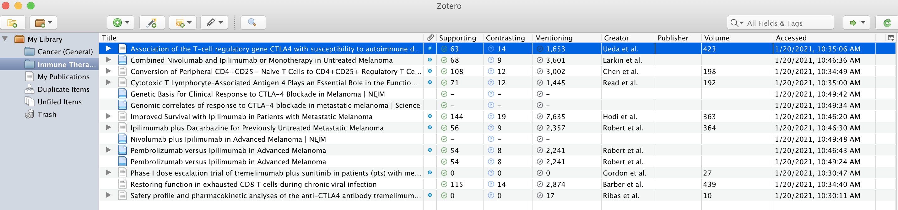
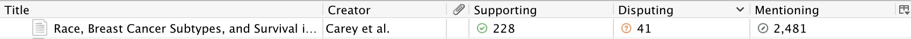
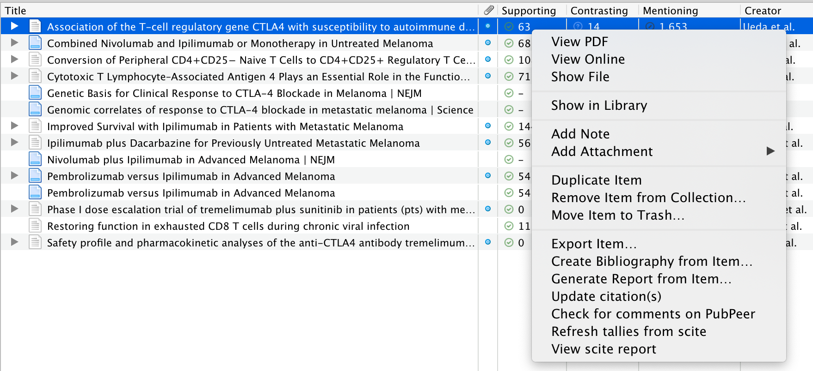

# scite-zotero-plugin

Welcome!

This is a Zotero plugin developed by [scite](https://scite.ai) so that you can enrich your library with information from us.

It currently lets you do two main things:
- See classification tallies for each paper based on our Smart Citation data
- Easily go to the scite report page (see below)

### Smart Citation Classification Tallies

Once you install the plugin (see below section for instructions), each row will have columns for `Supporting`, `Mentioning`, and `Contrasting`. The values in this cell tell you, for a given paper, how many citations there are in the scite database with the corresponding classification.

For example, here, the paper titled `Race, Breast Cancer Subtypes, and Survival in the Carolina Breast Cancer Study` has received `228 supporting citations`, `41 contrasting citations`, and `2,481 mentioning citations` from other publications in our database.

You can also sort on any of these 3 columns to see which papers are the most supported, contrasted, and so on.

These values will always be refreshed on launch, but you can refresh them individually by right-clicking on a row and selecting `Refresh tallies from scite`.

### Viewing a scite report

In order to explore the citation snippets around these classifications, you can view the scite report for the paper of interest. Simply right click a row and select `View scite report`. It should open the URL directly in your browser.

## Installation

Get the XPI file from https://github.com/scitedotai/scite-zotero-plugin/releases and install it in Zotero following the normal plugin procedure.

To install a plugin in Zotero, download its .xpi file to your computer. Then, in Zotero, click “Tools → Add-Ons”, then drag the .xpi for the plugin onto the Add-Ons window that opens.

## Changelog

NOTE: You only need to download once; it will auto update afterwards!

### [1.0.9](https://github.com/scitedotai/scite-zotero-plugin/releases/tag/v1.0.9)

- Fix edge case in how DOI is retrieved from zotero library metadata (prevents a JavaScript exception).

### [1.0.8](https://github.com/scitedotai/scite-zotero-plugin/releases/tag/v1.0.8)

- Add columns for Total Smart Citations and Total Distinct Citing Publications (for example: if `paper X` references `paper Y` a total of 4 times, then the count of Smart Citations for paper Y will be 4, and the count of citing publications will be 1. This is because Smart Citations count each individual in-text reference and are not grouped at the citing publication level.)

### [1.0.7](https://github.com/scitedotai/scite-zotero-plugin/releases/tag/v1.0.7)

- Use DOMParser and XMLSerializer.

### [1.0.6](https://github.com/scitedotai/scite-zotero-plugin/releases/tag/v1.0.6)

- Rename disputed to contrasted, and change the color of the icon from orange to blue.

### [1.0.5](https://github.com/scitedotai/scite-zotero-plugin/releases/tag/v1.0.5)

- Fix auto-update bug.

### [1.0.4](https://github.com/scitedotai/scite-zotero-plugin/releases/tag/v1.0.4)

- Add ability to resize `Supporting`, `Mentioning`, and `Disputing` columns.
### [1.0.3](https://github.com/scitedotai/scite-zotero-plugin/releases/tag/v1.0.3)

- Minor logging changes, trim whitespace from DOIs, and properly supports automatic updates.

### [1.0.2](https://github.com/scitedotai/scite-zotero-plugin/releases/tag/v1.0.2)

- Fixes bug where DOIs during bulk refresh were not properly being lower cased, and adds debug logging to triage issues in the future if it persists in other edge cases.

### [1.0.1](https://github.com/scitedotai/scite-zotero-plugin/releases/tag/v1.0.1)

- Fixes bug where DOI wasn't being lowercased properly

### [1.0.0](https://github.com/scitedotai/scite-zotero-plugin/releases/tag/v1.0.0)

Release initial version of plugin that allows you to:
- See the # supporting cites (separate column, sortable)
- See the # mentioning cites (separate column, sortable)
- See the # disputing cites (separate column, sortable)
- Directly view a scite report by right-clicking on a row and clicking 'View scite report')
- Refreshing the tallies whenever you want (right-click row and click the refresh tallies option)

## Instructions for local development

(These were originally from https://www.zotero.org/support/dev/client_coding/plugin_development but replicated here for convenience)

- Clone the repo
- `npm install` to get any dependencies
- `npm run build` will generate a `build/` folder for you. You should see an `install.rdf` file in this directory. If you open it, find the `<em:id>` tag and make note of the value.
- Make sure Zotero is closed
- In terminal, navigate to your Zotero profile directory

| Operating System      | Location |
| ----------- | ----------- |
| Mac      | /Users/<username>/Library/Application Support/Zotero/Profiles/<randomstring>       |
| Windows 10/8/7/Vista   | C:\Users\<User Name>\AppData\Roaming\Zotero\Zotero\Profiles\<randomstring>        |
| Windows XP/2000  | C:\Documents and Settings\<username>\Application Data\Zotero\Zotero\Profiles\<randomstring>        |
| Linux  | ~/.zotero/zotero/<randomstring>       |

NOTE: The above table is from https://www.zotero.org/support/kb/profile_directory

- Next, go into `extensions/` and create a text file matching the value you saw in the `<em:id>` tag. e.g. a file called `scite@scite.ai`
- Open this file, and in it, set the contents to be the absolute path to the `install.rdf` file from your `build/` directory
- `cd` back to the profile directory (one level above `extensions/`)
- Open the `prefs.js` file
- Comment out the lines containing `extensions.lastAppVersion` and `extensions.lastPlatformVersion`. Should only be needed once.
- Open Zotero, and you should see the extension get loaded

Notes:
- Doing `npm run build` will also generate an `xpi/` directory locally that you can directly add as a plugin into your Zotero
- It looks like Zotero has been migrating to Electron (or at least there may be plans for this; it's been discussed for the past 4 years). Due to the lack of support for XUL, clear plugin documentation, and the potential deprecation of this version of Zotero, a lot of this codebase was put together by looking at existing plugins that worked in similar ways. If you're trying to write a plugin, I'd recommend poking around these three excellent plugins:
    - https://github.com/PubPeerFoundation/pubpeer_zotero_plugin
    - https://github.com/jlegewie/zotfile
    - https://github.com/bwiernik/zotero-shortdoi

## Release

We use this package: https://github.com/retorquere/zotero-plugin-webpack

NOTES: (temporary workaround due to its implementation)
- If you make changes, do NOT run `npm version` before your pull request gets merged
- First merge in the pull request
- Then from `master`, pull locally
- While on `master`, run `npm version <version>`
- This will create a new tag, commit, and push and that will auto-trigger the CI to release it

If you run `npm version` before the PR gets merged, then the tagged commit will have a hash different from the commit hash in circle after it gets merged (github will always create a new commit for the merge)

TL;DR Let me do it ;)

## Questions

If you have any questions or have feedback, feel free to write to us at hi@scite.ai, or create an issue here.
