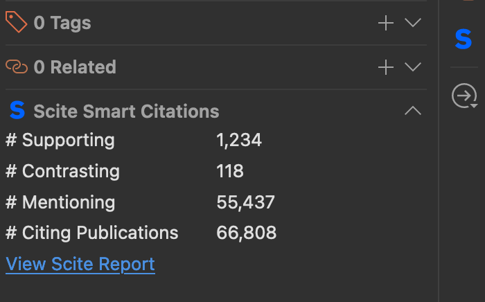

# Scite Zotero Plugin

A Zotero plugin by [Scite](https://www.scite.ai) that shows how papers in your library have been cited—supported, contradicted, or mentioned—without leaving Zotero.

**Please note that the latest version of this plugin at V2.0 onwards only supports Zotero 7 and above**. If you are looking for a plugin that supports Zotero 6, please use an [earlier release like v.1.11.6](https://github.com/scitedotai/scite-zotero-plugin/releases/tag/v1.11.6).

## Installation

Get the XPI file from https://github.com/scitedotai/scite-zotero-plugin/releases and install it in Zotero following the normal plugin procedure.

To install a plugin in Zotero, download its .xpi file to your computer. Then, in Zotero, click “Tools → Plugins”, then drag the .xpi for the plugin onto the Plugins Manager window that opens.

No account or API key required.

## Features

### Smart Citation tallies

The plugin adds five columns to your library:

| Column | What it shows |
|--------|---------------|
| Supporting | Citations that support the paper's findings |
| Contrasting | Citations that contrast with the paper's findings |
| Mentioning | Citations that reference the paper without taking a stance |
| Total Smart Citations | All in-text citation instances |
| Total Distinct Citing Publications | Unique papers that cite this work |

Don't see them? Right-click the column header and enable the ones you want.

**What are Smart Citations?** Traditional citations count paper-to-paper references. Smart Citations go deeper: scite analyzes the full text of citing articles and classifies the intent behind each citation using deep learning.

For example, here, the paper titled `Psychometric Properties of the Strengths and Difficulties Questionnaire` has received `207 supporting citations`, `26 contrasting citations`, `4,874 mentioning citations`, and `5,550 traditional citations` from other publications in our database. Note that a traditional citation is what you expect, i.e. a paper to paper level citation. A Smart Citation, like supporting, mentioning, contrasting, is unique to Scite because we index full-text articles from publishers and classify the intent of the citations based on our own deep learning models. You can [read about scite here](https://direct.mit.edu/qss/article/2/3/882/102990/scite-A-smart-citation-index-that-displays-the) or visit our [homepage to learn more](https://scite.ai).

You can also sort on any of these 3 columns to see which papers are the most supported, contrasted, and so on.

### Scite reports

Select any paper and click **View Scite Report** in the right panel to see the actual citation snippets in your browser.

### Sorting and refreshing

Sort by any Smart Citation column to surface your most supported or contested papers. Right-click a row to refresh its citation data.

## Changelog

NOTE: You only need to download once; it will auto update afterwards!

### [2.0.2](https://github.com/scitedotai/scite-zotero-plugin/releases/tag/v2.0.2)

- Fixes bug in Z7 compatible plugin where column sorting broke because the numbers were being converted to strings.

### [2.0.1](https://github.com/scitedotai/scite-zotero-plugin/releases/tag/v2.0.1)

- Adds support for Zotero 7 (not backwards compatible).

### [1.11.6](https://github.com/scitedotai/scite-zotero-plugin/releases/tag/v1.11.6)

- Removes scite icon from each cell; moves it into the header. Fixes a bug where one of the cells had unnecessary padding to the left. Also adds React to support using icons in the column header via `iconLabel`.

### [1.11.5](https://github.com/scitedotai/scite-zotero-plugin/releases/tag/v1.11.5)

- Re-enables scite plugin and fixes bug in patched `getField` function which was raising an exception for `int` fields being passed in, causing non-scite specific columns to go into the exception handler, which swallowed the exception and returned 0. This exception handler now only happens on scite specific columns as intended, and the handling of `field` is more robust to prevent the identified sources of exceptions.

### [1.11.4](https://github.com/scitedotai/scite-zotero-plugin/releases/tag/v1.11.4)

- Disables the scite plugin from doing anything when it loads -- due to intermittent bug found in Zotero 6 upgrade.

### [1.11.3](https://github.com/scitedotai/scite-zotero-plugin/releases/tag/v1.11.3)

- Fix bug where column sorting on scite specific columns did not work in Zotero 6.

### [1.11.2](https://github.com/scitedotai/scite-zotero-plugin/releases/tag/v1.11.2)

- Upgrade `zotero-plugin` dependency with support for Zotero 6 (backwards compatible), and use eslint instead of tslint.

### [1.11.1](https://github.com/scitedotai/scite-zotero-plugin/releases/tag/v1.11.1)

- Properly match scite column during `getField` call in XUL tree version.

### [1.11.0](https://github.com/scitedotai/scite-zotero-plugin/releases/tag/v1.11.0)

- Fix bug in beta build where the tally information in each row was not refreshed after the initial load from the API.

### [1.10.0](https://github.com/scitedotai/scite-zotero-plugin/releases/tag/v1.10.0)

- Add backwards-compatible support for upcoming Zotero release. This specifically makes the plugin work with the build `Zotero-5.0.97-beta.43+c5d89f6d0` but should generally support the new HTML based structure (in addition to the XUL version for any users who do not upgrade).
### [1.0.9](https://github.com/scitedotai/scite-zotero-plugin/releases/tag/v1.0.9)

- Fix edge case in how DOI is retrieved from zotero library metadata (prevents a JavaScript exception).

### [1.0.8](https://github.com/scitedotai/scite-zotero-plugin/releases/tag/v1.0.8)

- Add columns for Total Smart Citations and Total Distinct Citing Publications (for example: if `paper X` references `paper Y` a total of 4 times, then the count of Smart Citations for paper Y will be 4, and the count of citing publications will be 1. This is because Smart Citations count each individual in-text reference and are not grouped at the citing publication level.)

### [1.0.7](https://github.com/scitedotai/scite-zotero-plugin/releases/tag/v1.0.7)

- Use DOMParser and XMLSerializer.

### [1.0.6](https://github.com/scitedotai/scite-zotero-plugin/releases/tag/v1.0.6)

- Rename disputed to contrasted, and change the color of the icon from orange to blue.

### [1.0.5](https://github.com/scitedotai/scite-zotero-plugin/releases/tag/v1.0.5)

- Fix auto-update bug.

### [1.0.4](https://github.com/scitedotai/scite-zotero-plugin/releases/tag/v1.0.4)

- Add ability to resize `Supporting`, `Mentioning`, and `Disputing` columns.
### [1.0.3](https://github.com/scitedotai/scite-zotero-plugin/releases/tag/v1.0.3)

- Minor logging changes, trim whitespace from DOIs, and properly supports automatic updates.

### [1.0.2](https://github.com/scitedotai/scite-zotero-plugin/releases/tag/v1.0.2)

- Fixes bug where DOIs during bulk refresh were not properly being lower cased, and adds debug logging to triage issues in the future if it persists in other edge cases.

### [1.0.1](https://github.com/scitedotai/scite-zotero-plugin/releases/tag/v1.0.1)

- Fixes bug where DOI wasn't being lowercased properly

### [1.0.0](https://github.com/scitedotai/scite-zotero-plugin/releases/tag/v1.0.0)

Release initial version of plugin that allows you to:
- See the # supporting cites (separate column, sortable)
- See the # mentioning cites (separate column, sortable)
- See the # disputing cites (separate column, sortable)
- Directly view a scite report by right-clicking on a row and clicking 'View scite report')
- Refreshing the tallies whenever you want (right-click row and click the refresh tallies option)

## Instructions for local development

(These were originally from https://www.zotero.org/support/dev/client_coding/plugin_development but replicated here for convenience)

- Clone the repo
- `npm install` to get any dependencies
- `npm run build` will generate a `build/` folder for you. You should see an `install.rdf` file in this directory. If you open it, find the `<em:id>` tag and make note of the value.
- Make sure Zotero is closed
- In terminal, navigate to your Zotero profile directory

| Operating System      | Location |
| ----------- | ----------- |
| Mac      | /Users/<username>/Library/Application Support/Zotero/Profiles/<randomstring>       |
| Windows 10/8/7/Vista   | C:\Users\<User Name>\AppData\Roaming\Zotero\Zotero\Profiles\<randomstring>        |
| Windows XP/2000  | C:\Documents and Settings\<username>\Application Data\Zotero\Zotero\Profiles\<randomstring>        |
| Linux  | ~/.zotero/zotero/<randomstring>       |

NOTE: The above table is from https://www.zotero.org/support/kb/profile_directory

- Next, go into `extensions/` and create a text file matching the value you saw in the `<em:id>` tag. e.g. a file called `scite@scite.ai`
- Open this file, and in it, set the contents to be the absolute path to the `install.rdf` file from your `build/` directory
- `cd` back to the profile directory (one level above `extensions/`)
- Open the `prefs.js` file
- Comment out the lines containing `extensions.lastAppVersion` and `extensions.lastPlatformVersion`. Should only be needed once.
- Open Zotero, and you should see the extension get loaded

Notes:
- Doing `npm run build` will also generate an `xpi/` directory locally that you can directly add as a plugin into your Zotero
- It looks like Zotero has been migrating to Electron (or at least there may be plans for this; it's been discussed for the past 4 years). Due to the lack of support for XUL, clear plugin documentation, and the potential deprecation of this version of Zotero, a lot of this codebase was put together by looking at existing plugins that worked in similar ways. If you're trying to write a plugin, I'd recommend poking around these three excellent plugins:
    - https://github.com/PubPeerFoundation/pubpeer_zotero_plugin
    - https://github.com/jlegewie/zotfile
    - https://github.com/bwiernik/zotero-shortdoi

## Release

We use this package: https://github.com/retorquere/zotero-plugin

Note that it depends on having a `GITHUB_TOKEN` with a `repo` scope available. This is configured in the `CircleCI Project Settings` for this repo. I have a token I issued with scopes from my account; if it expires, you can always change it by generating your own.

This is how I do a release:
- If you make changes via pull request, do NOT run `npm version` before your pull request gets merged
- First merge in the pull request
- Then from `master`, pull locally to your machine
- While on `master`, run `npm version <version>`, e.g. `npm version 2.0.2`
- This will create a new tag, commit, and push and that will auto-trigger the CI to release it. You should be able to see the new release at https://github.com/scitedotai/scite-zotero-plugin/releases
- I usually manually update the description after the release is created
- Update README, etc.

If you run `npm version` before the PR gets merged, then the tagged commit will have a hash different from the commit hash in circle after it gets merged (github will always create a new commit for the merge)

## How to disable the plugin

In the event of a bug that gets released, the easiest way to disable the scite plugin is to:

- Go to `/client/content/config.js` and set the `PLUGIN_ENABLED` flag to `false`
- Merge this into `master`
- Then, from `master` locally, run `npm version <new_version>` to release a new version, e.g. if it was on `2.0.1`, run `npm version 2.0.2`.

## Questions

If you have any questions or have feedback, feel free to write to us at hi@scite.ai, or create an issue here.
